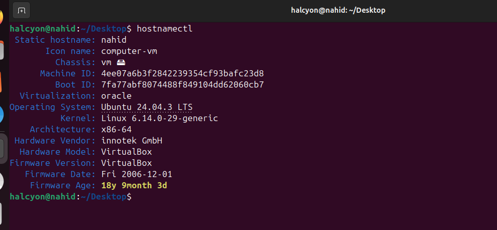
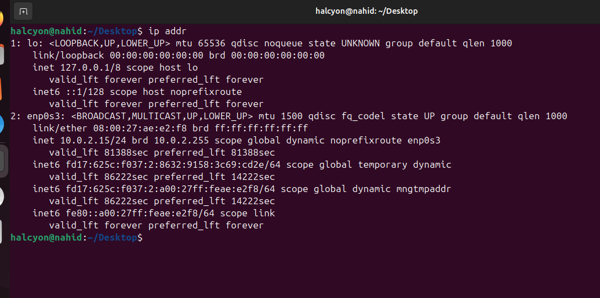

# System Information – `hostnamectl` & `ip addr`

System information commands are the **first step** in diagnosing any Linux server.  
As a DevOps Engineer, you must quickly verify the **system identity** and **network configuration** before debugging further.

This document covers two essential commands:

- `hostnamectl` → System hostname, OS, kernel version  
- `ip addr` → Network interfaces & IP addresses  

---

## 🔹 1. `hostnamectl`

The `hostnamectl` command provides detailed information about the system’s **hostname, OS, kernel, and virtualization**.

### ✅ Usage

`hostnamectl`   
Sample Output :-

### 🎯 Why DevOps Engineers Use This

- Identify **OS distribution & version** before deployment.

- Check **virtualization type** (VM, container, or bare-metal).

- Validate **kernel version** for compatibility with apps/tools.
## 🔹 2. ip addr

The ip addr command displays the system’s network interfaces and IP addresses.

### ✅ Usage

`ip addr`     
   
Sample Output :-

### 🎯 Why DevOps Engineers Use This

- Verify **private/public IPs** for cloud instances.

- Confirm **network interface state (UP/DOWN)**.

- Troubleshoot **IP conflicts or subnet issues**.

### 📌 Quick Reference Table

| Command       | Purpose                           | Example Use Case                        |
|---------------|-----------------------------------|-----------------------------------------|
| `hostnamectl` | Show hostname, OS, kernel, VM info| Check OS version before configuration    |
| `ip addr`     | Show IPs & interfaces             | Debug why a server is unreachable        |

With just these two commands, you can confirm what system you’re on and how it connects to the network — the foundation of any DevOps troubleshooting workflow.
